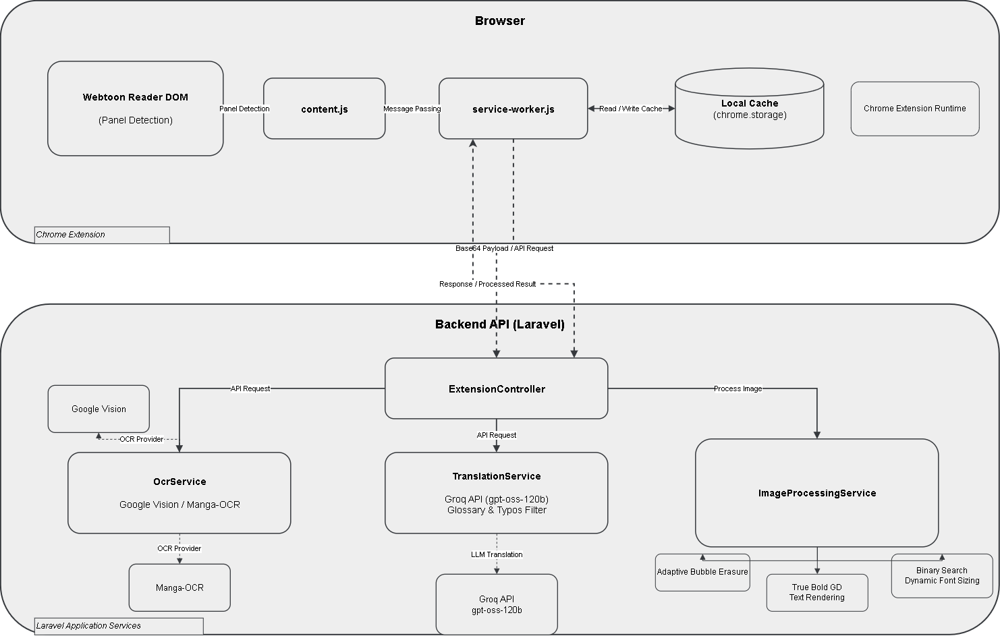

# KomikoID MTL (extension_mtl_komik)

An end-to-end Machine Translation (MTL) and in-place image replacement system designed for web comics, manhwa, and manga directly inside the browser.

The project combines a Chrome Extension (Manifest V3) for DOM extraction, smart background queuing, and image replacement with a high-performance Laravel backend responsible for Optical Character Recognition (OCR), LLM-powered context-aware translation, text bubble cleaning, and dynamic typography rendering.

---

## Table of Contents

- [Overview](#overview)
- [Key Features](#key-features)
- [System Architecture](#system-architecture)
- [Repository Structure](#repository-structure)
- [Getting Started](#getting-started)
  - [Prerequisites](#prerequisites)
  - [Installation Guide](#installation-guide)
- [Configuration Reference](#configuration-reference)
- [Technical Highlights](#technical-highlights)
- [License](#license)

---

## Overview

Reading untranslated webtoons and manga often requires manual copy-pasting or dealing with distracting floating overlay boxes. **KomikoID MTL** solves this by performing direct **Image Replacement**:

1. Scans and isolates comic strip panels inside web reader pages.
2. Extracts speech bubble text using OCR engines.
3. Translates dialogues using specialized LLMs with domain glossary preservation (retaining terms like *Hunter*, *Dungeon*, *Gate*, *S-Rank*).
4. Cleans the original speech bubbles and renders the translated text directly onto the image with dynamically scaled, bold typography.
5. Swaps the original image in the DOM seamlessly, allowing readers to toggle between RAW and translated versions with one click.

---

## Key Features

- **Full-Chapter Eager Pre-Translation:** Translates all comic panels in the background upon opening a chapter, prioritizing visible panels first so reading can begin immediately without scrolling pauses.
- **Persistent Local Client Cache:** Implements an LRU-evicted local cache in `chrome.storage.local` (`unlimitedStorage`). Revisiting chapters loads translated images in 0ms without re-requesting the backend.
- **Domain-Preserving Translation:** Backed by Groq API (`openai/gpt-oss-120b`), engineered to maintain comic/manhwa specific terminology and automatically correct common OCR character misreads (e.g., *HLNTER* &rarr; *HUNTER*, *SLNG* &rarr; *SUNG*).
- **Clean Inpainting & Bubble Erasure:** Edge-sampled solid color fills with adaptive margins, eliminating ghost outlines and leftover text shadows.
- **Dynamic Binary-Search Typography:** Automatically calculates the optimal font size per bubble to maximize readability while preventing boundary overflow, rendered with true bold Gothic typefaces.
- **Original vs MTL Toggle:** Injects an interactive badge on each processed image for instant side-by-side inspection between RAW source and translated results.

---

## System Architecture

<p align="center">
  
</p>

---

## Repository Structure

```
extension_mtl_komik/
├── .vscode/                     # Recommended editor settings and intelephense configs
├── backend/                     # Laravel 11 Backend Service
│   ├── app/
│   │   ├── Http/Controllers/    # API endpoints (ExtensionController, etc.)
│   │   ├── Services/            # Core business logic:
│   │   │   ├── ImageProcessingService.php  # Text cleaning & rendering
│   │   │   ├── OcrService.php              # OCR extraction orchestration
│   │   │   └── TranslationService.php      # LLM prompt & terminology rules
│   │   └── Models/              # Database entities
│   ├── config/                  # Service configurations (groq.php, ocr.php, etc.)
│   ├── database/                # Migrations and seeders
│   └── routes/                  # API route definitions
├── extension/                   # Chrome Extension (Manifest V3)
│   ├── background/              # service-worker.js (caching & network bridge)
│   ├── content/                 # content.js & content.css (DOM scan & replacement)
│   ├── popup/                   # Extension popup interface & settings
│   ├── icons/                   # Extension branding assets
│   └── manifest.json            # MV3 configuration
├── .gitignore                   # Root repository ignore rules
└── README.md                    # Project documentation
```

---

## Getting Started

### Prerequisites

- **Google Chrome**: Or any Chromium-based browser (Edge, Brave, Opera) supporting Manifest V3.

> [!NOTE]
> The AI Backend is already **pre-configured and hosted in the cloud**. Users do not need to install PHP, Composer, Python, or configure any server.

---

### Installation Guide

1. Clone or download this repository.
2. Open Google Chrome and navigate to `chrome://extensions`.
3. Enable **Developer mode** via the toggle in the upper-right corner.
4. Click the **Load unpacked** button in the top-left corner.
5. Select the `extension` folder from this repository.
6. The KomikoID MTL extension icon will now appear in your browser toolbar.
7. Click the extension icon to view the popup. The status indicator will display **Online**. You are ready to start reading and translating comics immediately!

---

## Configuration Reference

### Extension Settings (Popup)

- **Target Language:** Select output language (`id`, `en`, `es`, `pt`).
- **Source Language:** Select comic language or set to Auto-Detect (`ja`, `ko`, `zh`, `en`).
- **Auto-Translate on Chapter Open:** Automatically batches and translates all panels when opening a reader page.

---

## Technical Highlights

### 1. Robust OCR Noise Auto-Correction
Webtoon fonts and stylized calligraphy often introduce OCR noise (such as `HLNTER` instead of `HUNTER`, or `SLNG` instead of `SUNG`). The backend pipeline cleans common character confusions before dispatching to the LLM, and utilizes domain-specific system prompts to prevent hallucinated rewrites.

### 2. Strict Terminology Preservation
Fantasy and RPG manhwa rely on universally recognized terminology. The translation service enforces strict whitelist preservation for terms including:
- Classes & Entities: `Hunter`, `Awakened`, `Player`, `Guild`, `Master`, `Monster`, `Boss`
- Ranks & Tiers: `S-Rank`, `A-Rank`, `B-Rank`, `C-Rank`, `D-Rank`, `E-Rank`
- Mechanics: `Dungeon`, `Gate`, `Raid`, `Quest`, `Mana`, `Status Window`, `Inventory`, `Party`

### 3. Smart Background Queuing & In-Memory LRU Cache
Instead of overwhelming the backend with 50+ simultaneous image requests, `content.js` prioritizes panels within the active viewport before queuing downward offscreen panels sequentially. Translated results are stored with an LRU cache index in `chrome.storage.local`, enabling instant offline review when flipping back and forth between chapters.

---

## License

This project is licensed under the [MIT License](LICENSE).
